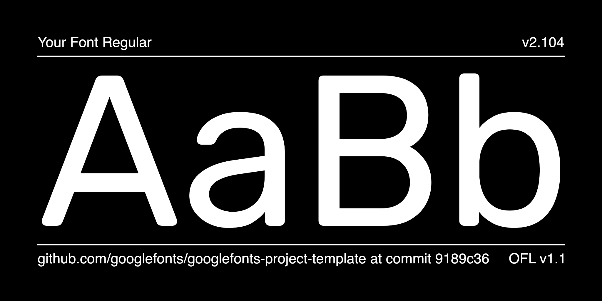
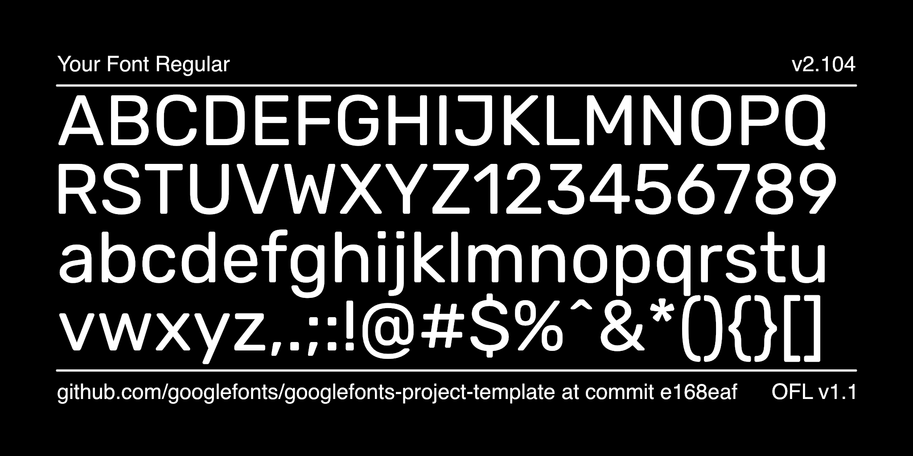

----

## Setting up your font

### New repositories

1. Hit the green button above ("Use this template") to create your own repository.

2. Clone the repository, and replace the font sources in the `sources` directory with your own font sources. These sources may be either in Glyphs format or UFO/Designspace formats.\
\
Unlike many open source distributors, Google Fonts is **curated**. Fonts shipped to the platform have to match the [Google Fonts Specifications](https://github.com/googlefonts/gf-docs/tree/main/Spec). Please read them carefully.\
\
*(The sample font provided in this template is [Rubik](https://github.com/googlefonts/rubik/) by Philipp Hubert, Sebastian Fischer, and contributors.)*

3. Then reference the sources in the file `sources/config.yaml`, as well as making any other changes you would like to make based on the instructions in the [Google Fonts Builder documentation](https://github.com/googlefonts/gftools/blob/main/Lib/gftools/builder/__init__.py).

4. Add yourself to the `AUTHORS.txt` and `CONTRIBUTORS.txt` files.

5. Fill out `documentation/DESCRIPTION.en_us.html` with a description about your font.

6. Rewrite this Readme file according to the recommendations in the [Google Fonts Guide](https://googlefonts.github.io/gf-guide/readmefile.html).

7. Add and commit these files to git.

8. **At the command line, run `make customize` to ensure that all the paths and URLs in your project are correct**. This will also push your changes to GitHub.

9. **Set up your GitHub pages site**: go to Settings > Pages and ensure that the "Source" drop-down is set to "Deploy from a Branch". Ensure that the "Branch" is set to `gh-pages`. If this branch is not available, check that the "Build font and specimen" action in the "Actions" tab has completed; if it completed successfully, then try again - `gh-pages` should now be an option.

10. If Github Actions has successfully built the family, you will find the font binaries in the Actions tab. The official Github Actions documentation provides further [information](https://docs.github.com/en/actions/managing-workflow-runs/downloading-workflow-artifacts).

### Updating a repository

1. To update your font repository to bring in the latest best-practices from the Google Fonts Project Template, run `make update-project-template` from the command line. This requires the `node` Javascript engine to be installed; if you don't have that already, [follow these instructions](https://nodejs.org/en/download/package-manager#macos) to install on your platform.

2. To update the Python build chain which builds your fonts, run `make update` and `git add`/`git commit` the new `requirements.txt`.

## More things to do

* `CustomFilter_GF_Latin_All.plist` in `sources` is practical if you use GlyphsApp, you can remove it otherwise. Placed in the same directory as the your `.glyphs` file, it will allow Glyphs to display a filter list for all GF Latin glyphsets in app. To make sure your font supports the minimal set required by Google Fonts, look at the `GF_Latin_Core` filter list. Find other glyphsets and list formats for different software in [GF Glyphsets repository](https://github.com/googlefonts/glyphsets/tree/main/GF_glyphsets).

* Once you are happy with your font, add promotional assets in the documentation directory. Make it different from the pic you use in this README. You can get inspired by existing tweet @googlefonts like: https://twitter.com/googlefonts/status/1415562928657416192.

* Google Fonts uses Github Releases to manage font families. If you feel your font project has hit a milestone, you must create a new release for it. In order to do this, go to the releases page and hit the "Draft a new release button". You must provide a tag number and title which can only be a decimal number e.g 0.100, 1.000 etc. For the body text, mention what has changed since the last release. Once you are done, hit the "Publish release" button. Here is an example which fulfills the requirements, https://github.com/m4rc1e/test-ufr-family/releases/tag/2.019. For more info regarding Github release, please see the official Github Release [documentation](https://docs.github.com/en/repositories/releasing-projects-on-github/managing-releases-in-a-repository). **Please note that Github Actions must be able to build the fonts before you can make a release. Once you have made a release, the fonts and tests assets will be attached to the release automatically. This may take a while since the fonts and tests will be built from scratch so please be patient.**

----

# My Font

[![][Fontbakery]](https://simoncozens.github.io/buenard/fontbakery/fontbakery-report.html)
[![][Universal]](https://simoncozens.github.io/buenard/fontbakery/fontbakery-report.html)
[![][GF Profile]](https://simoncozens.github.io/buenard/fontbakery/fontbakery-report.html)
[![][Shaping]](https://simoncozens.github.io/buenard/fontbakery/fontbakery-report.html)

[Fontbakery]: https://img.shields.io/endpoint?url=https%3A%2F%2Fraw.githubusercontent.com%2Fsimoncozens%2Fbuenard%2Fgh-pages%2Fbadges%2Foverall.json
[GF Profile]: https://img.shields.io/endpoint?url=https%3A%2F%2Fraw.githubusercontent.com%2Fsimoncozens%2Fbuenard%2Fgh-pages%2Fbadges%2FGoogleFonts.json
[Outline Correctness]: https://img.shields.io/endpoint?url=https%3A%2F%2Fraw.githubusercontent.com%2Fsimoncozens%2Fbuenard%2Fgh-pages%2Fbadges%2FOutlineCorrectnessChecks.json
[Shaping]: https://img.shields.io/endpoint?url=https%3A%2F%2Fraw.githubusercontent.com%2Fsimoncozens%2Fbuenard%2Fgh-pages%2Fbadges%2FShapingChecks.json
[Universal]: https://img.shields.io/endpoint?url=https%3A%2F%2Fraw.githubusercontent.com%2Fsimoncozens%2Fbuenard%2Fgh-pages%2Fbadges%2FUniversal.json

Description of your font goes here. We recommend to start with a very short presentation line (the kind you would use on twitter to present your project for example), and then add as much details as necesary :-) Origin of the project, idea of usage, concept of creation… but also number of masters, axes, character sets, etc.

Don't hesitate to create images!

## About

Description of you and/or organisation goes here.

## Building

Fonts are built automatically by GitHub Actions - take a look in the "Actions" tab for the latest build.

If you want to build fonts manually on your own computer:

* `make build` will produce font files.
* `make test` will run [FontBakery](https://github.com/googlefonts/fontbakery)'s quality assurance tests.
* `make proof` will generate HTML proof files.

The proof files and QA tests are also available automatically via GitHub Actions - look at https://simoncozens.github.io/buenard.

## Changelog

When you update your font (new version or new release), please report all notable changes here, with a date.
[Font Versioning](https://github.com/googlefonts/gf-docs/tree/main/Spec#font-versioning) is based on semver. 
Changelog example:

**26 May 2021. Version 2.13**
- MAJOR Font turned to a variable font.
- SIGNIFICANT New Stylistic sets added.

## License

This Font Software is licensed under the SIL Open Font License, Version 1.1.
This license is available with a FAQ at
https://scripts.sil.org/OFL

## Repository Layout

This font repository structure is inspired by [Unified Font Repository v0.3](https://github.com/unified-font-repository/Unified-Font-Repository), modified for the Google Fonts workflow.
